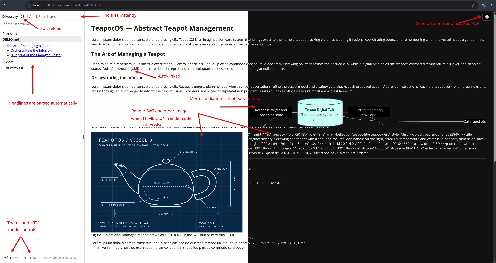

# NoPainMD


[](https://github.com/VasyaSh/NoPainMD/actions/workflows/node.js.yml)

Developers are working with more Markdown than ever. AI tools and agents often
take their instructions from `.md` files, and many use terminal interfaces,
so we're spending more time in the console too. NoPainMD makes reading all those
files a little easier: start it from your terminal and get instant, convenient
access to your workspace's Markdown files in a clean web interface.

Built with Node.js, TypeScript, and vanilla CSS, without a UI framework.
Requires Node.js 22 or newer. Run it locally, or bundle with your application!

## Features

Find `.md` and `.markdown` files in a searchable directory tree, jump to headings,
and follow links between documents.
View Mermaid diagrams and embedded SVG, toggle HTML rendering, and read comfortably
with light or dark themes and a resizable sidebar.
Refresh files without losing your place, and print documents without the
surrounding navigation or controls.



## Get Started

The npm package is named `nopainmd` and is published by
[`vasyash`](https://www.npmjs.com/~vasyash). Install it globally from npm:

```sh
npm install -g nopainmd
```

Alternatively, install it globally from a cloned Git repository:

```sh
git clone https://github.com/VasyaSh/NoPainMD.git
cd NoPainMD
npm ci
npm pack
npm install -g ./nopainmd-0.1.14.tgz
```

`npm pack` builds and bundles the browser assets automatically. If the version
changes, use the `.tgz` filename printed by that command.

After either installation method, launch it from the directory you want to browse:

```sh
cd /path/to/your/documents
nopainmd
```

`npx nopainmd` also runs it without a global installation.

If the requested port is busy, an interactive terminal prompts for another port.
Press `Enter` to let the OS choose an available port. Noninteractive startup fails
with instructions instead; use `--port 0` to request an available port explicitly.
Browser-launch failures leave the URL in the terminal for manual opening.

## Configuration

Set these variables in your shell or in a `.env` file in the directory where you
launch NoPainMD; see [.env.example](.env.example).

- `NOPAINMD_BASE_DIR` selects the directory to browse, defaulting to `.` (the directory where you launch NoPainMD).
- `NOPAINMD_HOST` sets the server's hostname or address, defaulting to `localhost`.
- `NOPAINMD_PORT` sets the server port, defaulting to `3000`, with `0` choosing an available port automatically.
- `NOPAINMD_FONT` sets the text font using its literal name, defaulting to the bundled `Open Sans`; preformatted text and code blocks use `monospace`.
- `NOPAINMD_FONT_ZOOM` scales text and document content as a percentage, defaulting to `100` (100%).
- `NOPAINMD_HTML_ENABLED` controls raw HTML rendering, defaulting to `true` unless a saved browser toggle choice overrides it; Markdown images and Mermaid diagrams render in either mode.
- `NOPAINMD_INDEX_MAX_MS` sets the indexing time limit in milliseconds, defaulting to `5000` (5 seconds).
- `NOPAINMD_INDEX_MAX_NODES` limits the number of files and directories included in the tree, counting collapsed entries too, and defaults to `1000`.
- `NODE_DEBUG` enables detailed read-error logging to stderr when it includes `nopainmd`, defaults to disabled, and must be set in the launch environment rather than the application's `.env` file.

To diagnose unreadable files or directories, start with:

```sh
NODE_DEBUG=nopainmd nopainmd
```

Each diagnostic includes the operation, affected path, error code when available,
and error message. Normal indexing summaries and browser messages remain unchanged.

## Embed in a web application

Mount the viewer inside your application and connect it to the NoPainMD server
or a custom `ViewerDataSource`.

```text
+----------------------+
| Your web application |
|   NoPainMD viewer    |
+----------+-----------+
           |
           +--> NoPainMD server --> Local Markdown files
           |
           +--> Your data source (optional)
```

Install `nopainmd` as an application dependency, then import the complete viewer:

```sh
npm install nopainmd
```

```html
<div id="markdown-viewer" style="height: 80vh"></div>
```

```ts
import { mountNoPainMD, type NoPainMDViewer } from 'nopainmd';

const container = document.querySelector<HTMLElement>('#markdown-viewer');
if (!container) throw new Error('Viewer container is missing.');

const viewer: NoPainMDViewer = mountNoPainMD(container, {
  apiBaseURL: '/docs-api/',
  assetBaseURL: '/nopainmd/',
  storageKey: 'my-app.docs',
});

await viewer.ready;
await viewer.open('/absolute/path/to/README.md');
// When the host component is removed:
viewer.destroy();
```

Serve or proxy a NoPainMD API at `/docs-api/`, and copy
`node_modules/nopainmd/dist/public/fonts` to your app's static
`/nopainmd/fonts` directory, including its license and notice. Bundle the import
with your application; Mermaid, HTML sanitization, and viewer styles are included.
When serving `dist/public/viewer.js` directly, keep its sibling JavaScript chunks
and `fonts` directory together; `assetBaseURL` then defaults to that directory.

| Viewer behavior / option | Description |
| --- | --- |
| Container | Width and height are controlled by the host application. |
| Isolation | Shadow DOM isolates styles; multiple viewer instances are supported. |
| Included controls | Theme, HTML, navigation, search, sidebar resizing, and document-only printing. |
| `history` | Defaults to `false`; `true` enables document URLs and Back/Forward navigation. |
| `updateTitle` | Defaults to `false`; `true` lets the viewer update the browser tab title. |
| `onNavigate(file, hash)` | Navigation callback for integration with a host router. |
| `onDocumentChange(document)` | Document-change callback; receives a `MarkdownDocument` or `null`. |
| `source` | Custom `ViewerDataSource`; replaces the HTTP source configured through `apiBaseURL`. |

| `NoPainMDViewer` method | Returns | Description |
| --- | --- | --- |
| `open(file, hash?)` | `Promise<void>` | Opens an absolute file path and optional heading fragment. |
| `reload()` | `Promise<void>` | Refreshes the open document and directory tree. |
| `setTheme(theme)` | `Promise<void>` | Selects `'light'` or `'dark'`. |
| `setHTMLEnabled(enabled)` | `Promise<void>` | Enables or disables raw HTML rendering in the open document. |
| `destroy()` | `void` | Cancels pending work and removes the UI, listeners, and font registrations; safe to call repeatedly. |

| `ViewerDataSource` method | Returns | Contract |
| --- | --- | --- |
| `getConfig(signal?)` | `Promise<ViewerConfig>` | Supplies viewer settings; accepts an optional cancellation signal. |
| `getDocument(file, options)` | `Promise<MarkdownDocument>` | Accepts `options.htmlEnabled` and optional `options.signal`; supplies the requested rendering and an `alternate` rendering for immediate HTML toggling. |
| `index(selected, signal?)` | `Promise<IndexResult>` | Supplies the directory tree for the selected file path or `null`; accepts an optional cancellation signal. |
| `imageURL(file, token)` | `string` | Optional method that resolves a document image URL. |

| Module / integration | Reference |
| --- | --- |
| `nopainmd` | Browser exports include `mountNoPainMD`, `createHTTPSource`, and types for viewer options, handles, documents, headings, configuration, and tree nodes; importing does not start a server or mount a UI. |
| `nopainmd/server` | Node exports include `createApp`, `createConfig`, and `renderMarkdown`. |
| CLI server | Enforces same-origin request checks; use a same-origin proxy when embedding it in another application. |

Style the container with your application's CSS to set the viewer's dimensions.
To change its appearance, add a stylesheet inside its open Shadow DOM after
mounting and before calling `destroy()`:

```ts
const customStyles = document.createElement('style');
customStyles.textContent = `
  .nopainmd-viewer[data-theme="light"] {
    --paper: #faf8f2;
    --selection: #e8e4dc;
  }
  .nopainmd-viewer[data-theme="dark"] {
    --paper: #181818;
    --selection: #303030;
  }
  .nopainmd-viewer #content { line-height: 1.6; }
`;
viewer.element.before(customStyles);
```

The color variables are `--sidebar`, `--paper`, `--text`, `--muted`, `--selection`,
and `--line`; use `data-theme` selectors to customize each theme independently.
Set fonts and zoom through the server configuration or your data source's
`getConfig()` result (`font` and `fontZoom`). Host-page CSS selectors cannot reach
inside the viewer. These added styles affect the on-screen viewer; the print
document uses the bundled print styles, and Mermaid colors follow the selected
light or dark theme.

## Licenses and assets

Application code: MIT, see `LICENSE`. Bundled historical Open Sans fonts:
Apache 2.0, see `public/fonts/LICENSE.txt` and `public/fonts/NOTICE.txt`.
Mermaid's license is included at `dist/public/vendor/mermaid/LICENSE`; dependency
license notices accompany the browser bundles.
DOMPurify is distributed under its Apache 2.0 option; its license is included at
`dist/public/vendor/dompurify/LICENSE` and its copyright notice accompanies the bundle.

The browser tab icon shows `.md` in white on a black disc, making NoPainMD easy
to spot among your tabs.
